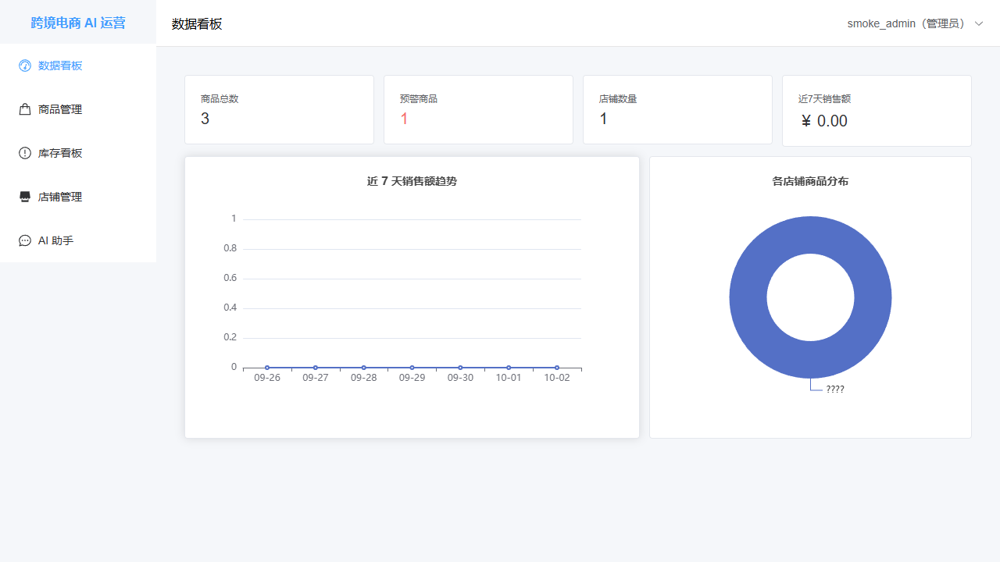
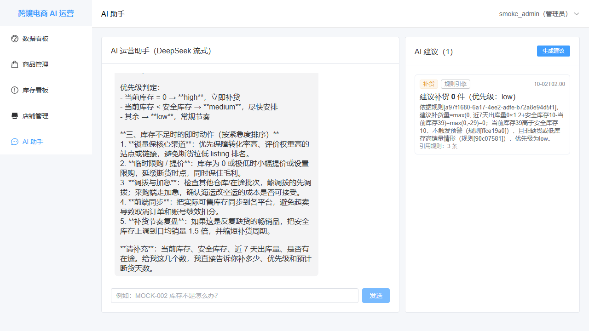
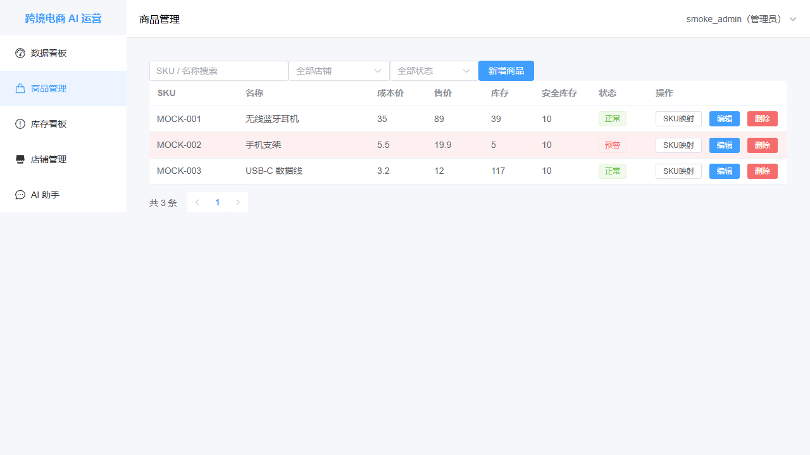
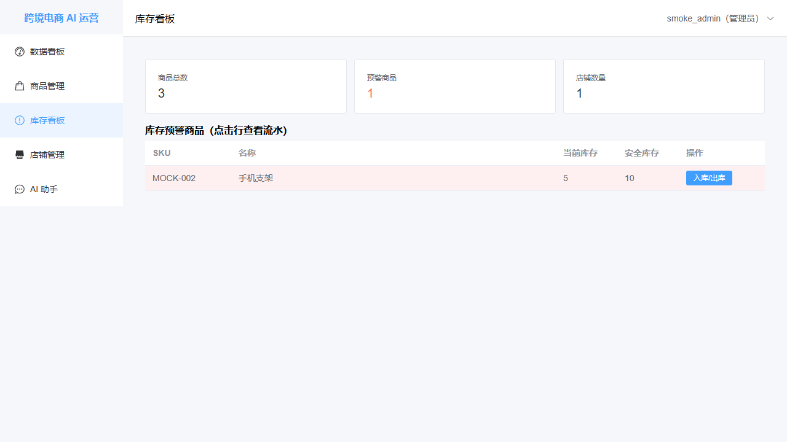
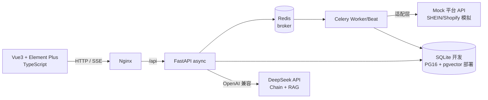

<div align="center">

# 🛒 跨境电商 AI 辅助运营系统

**FastAPI + Vue3 + DeepSeek 的全栈 AI 应用：多店铺同步 · 库存预警 · AI 补货/定价建议**

[](https://www.python.org/)
[](https://fastapi.tiangolo.com/)
[](https://vuejs.org/)
[](https://www.typescriptlang.org/)
[](https://element-plus.org/)
[](https://www.deepseek.com/)
[](https://docs.celeryq.dev/)
[](#-测试)

</div>

---

## ✨ 项目亮点

- 🤖 **AI 四级降级链** — Prompt JSON 约束 → 解析重试 → 规则引擎 → 内置规则，LLM 任何一级失败接口都正常返回，演示永不中断
- 📦 **多店铺同步幂等** — 按店铺+SKU upsert，重复同步商品数不变、仅库存差异写流水（有测试验证）
- 📒 **账实分离** — 库存流水与余额同事务更新，出库不足自动回滚，流水推演余额恒等于实际余额
- 🔌 **平台适配层** — 业务只依赖统一接口，Mock 平台 → 真实 SHEIN/Shopify 仅改一处实现
- 🗄️ **双数据库策略** — 开发 SQLite（零安装，克隆即跑）→ 部署 PostgreSQL + pgvector，一行环境变量切换
- 🔐 **安全内建** — JWT + bcrypt + AES-256-GCM 凭证加密（接口永不回显）+ RBAC 三级角色

## 🖼️ 功能预览

| 数据看板 | AI 流式对话 |
|---|---|
|  |  |
| **商品管理** | **库存看板（预警高亮）** |
|  |  |

## 🏗️ 架构



## 🚀 快速开始

### 环境要求

- Python 3.11+、Node 18+
- 无需预装数据库（开发阶段 SQLite + Celery eager 模式）

### 1️⃣ 启动后端

```powershell
cd backend
python -m venv .venv
.venv\Scripts\Activate.ps1
pip install -r requirements.txt

alembic upgrade head                      # 建表（SQLite）
python scripts\seed_rules.py              # 写入 RAG 运营规则
.venv\Scripts\python.exe -m uvicorn app.main:app --reload   # :8000
```

### 2️⃣ 启动 Mock 平台（同步功能依赖）

```powershell
# 项目根目录
backend\.venv\Scripts\python.exe -m uvicorn mock_platform.main:app --port 8001
```

### 3️⃣ 启动前端

```powershell
cd frontend
npm install
npm run dev        # http://localhost:5173（/api 已代理到 8000）
```

### 4️⃣ 配置 AI（可选）

设置环境变量 `DEEPSEEK_API_KEY` 即启用真实 AI；未配置时自动走规则引擎兜底，所有功能仍可演示。详见 [backend/README.md](backend/README.md) 环境变量表。

## 📁 项目结构

```
cb-smart-ops/
├── backend/           # FastAPI 后端（分层：routers→services→models，详见其 README）
│   ├── app/           # core / models / schemas / routers / services / tasks / ai / utils
│   ├── alembic/       # 数据库迁移
│   └── tests/         # pytest 31 项
├── frontend/          # Vue3 + TS 前端（详见其 README）
│   └── src/           # api / stores / router / layouts / views(6页面) / types
├── mock_platform/     # Mock 平台服务（模拟 SHEIN/Shopify 接口行为）
└── docs/screenshots/  # 功能截图
```

## 🧪 测试

```powershell
# 后端：31 项（RBAC 权限矩阵 / 同步幂等 / 账实一致性 / AI 降级链 / SSE 帧格式）
cd backend && .venv\Scripts\python.exe -m pytest -v

# 前端：3 项冒烟 + vue-tsc 全量类型检查
cd frontend && npm test && npm run build
```

## 📖 更多文档

- [backend/README.md](backend/README.md) — 后端 API、环境变量、技术亮点详解
- [frontend/README.md](frontend/README.md) — 页面清单、SSE 解析方案、构建说明

## 🗺️ Roadmap

- [x] 多店铺商品同步（Mock 平台）
- [x] 库存预警 + AI 补货/定价建议（DeepSeek + RAG）
- [x] 运营数据看板 + AI 流式对话
- [ ] Docker Compose 一键部署（PG + Redis + Nginx）
- [ ] 真实 SHEIN/Shopify API 对接
- [ ] 定价建议接入真实竞品数据源

---

<div align="center">

**开发者**：[Littlewit](https://github.com/Littlewit) · 11 年前端经验，专注 Python 后端 / AI 应用工程化

</div>
